# 🚀 Production-Ready CI/CD Pipeline

> **A comprehensive, enterprise-grade CI/CD pipeline template showcasing modern DevOps practices with Python, FastAPI, Docker, and GitHub Actions.**

[](https://github.com/mehulsaxena/production-ready-cicd/actions)
[](https://github.com/mehulsaxena/production-ready-cicd)
[](https://github.com/mehulsaxena/production-ready-cicd)
[](https://mehulsaxena.github.io/production-ready-cicd/)

## 📖 Overview

This repository demonstrates a **production-ready CI/CD pipeline** that implements industry best practices for:

- ✅ **Automated Testing** with comprehensive coverage
- 🛡️ **Multi-layer Security Scanning** (code, dependencies, containers)
- 🐳 **Container Security** with vulnerability assessment
- 📊 **Code Quality Assurance** with automated formatting and linting
- 🌐 **Automated Documentation** deployment
- 📈 **Professional Reporting** and monitoring

**🔗 Live Demo:** [https://mehulsaxena.github.io/production-ready-cicd/](https://mehulsaxena.github.io/production-ready-cicd/)

---

## 🏗️ Architecture Overview

```mermaid
graph LR
    A[Code Push] --> B[🧪 Test & Quality]
    B --> C[🐳 Build Container]
    C --> D[🛡️ Security Scan]
    D --> E[🌐 Deploy Docs]
    E --> F[📊 Report Results]
    
    style A fill:#e1f5fe
    style B fill:#f3e5f5
    style C fill:#e8f5e8
    style D fill:#fff3e0
    style E fill:#fce4ec
    style F fill:#f1f8e9
```



### **Pipeline Stages**

| Stage | Purpose | Tools Used | Duration |
|-------|---------|------------|----------|
| **🧪 Test & Quality** | Code validation, testing, style checks | Black, Flake8, Pytest | ~2 min |
| **🐳 Build Container** | Docker image creation and registry push | Docker, GitHub Container Registry | ~3 min |
| **🛡️ Security Scan** | Vulnerability assessment of containers | Trivy, Bandit, Safety | ~2 min |
| **🌐 Deploy Docs** | Automated documentation deployment | GitHub Pages | ~1 min |
| **📊 Report Results** | Pipeline status and summary generation | GitHub Actions | ~30 sec |

---

## 🚀 Quick Start

### **Prerequisites**

- Python 3.11+
- Docker (optional, for local container testing)
- Git

### **1. Clone and Setup**

```bash
# Clone the repository
git clone https://github.com/mehulsaxena/production-ready-cicd.git
cd production-ready-cicd

# Create virtual environment
python -m venv venv
source venv/bin/activate  # On Windows: venv\Scripts\activate

# Install dependencies
pip install -r requirements.txt
```

### **2. Run Locally**

```bash
# Start the FastAPI application
uvicorn main:app --host 0.0.0.0 --port 8000

# Or run with auto-reload for development
uvicorn main:app --reload
```

**🌐 Access your application:**
- **API Documentation:** http://localhost:8000/docs
- **Health Check:** http://localhost:8000/health
- **API Status:** http://localhost:8000/api/status

### **3. Run Tests**

```bash
# Run all tests with coverage
pytest --cov=. --cov-report=html -v

# Run security scans
bandit -r .
safety check

# Check code quality
black --check .
flake8 .
```

### **4. Docker Deployment**

```bash
# Build Docker image
docker build -t production-ready-cicd .

# Run container
docker run -p 8000:8000 production-ready-cicd

# Or use the pre-built image from GitHub Container Registry
docker run -p 8000:8000 ghcr.io/mehulsaxena/production-ready-cicd:latest
```

---

## 🛠️ Using This Template

### **Step 1: Fork and Customize**

1. **Fork this repository** to your GitHub account
2. **Clone your fork** locally
3. **Update configuration files:**
   - `main.py` - Modify API endpoints and business logic
   - `requirements.txt` - Add your dependencies
   - `docs/` - Customize documentation
   - `.github/workflows/ci-cd.yml` - Adjust pipeline if needed

### **Step 2: Configure GitHub Repository**

#### **Enable GitHub Pages**
1. Go to **Settings** → **Pages**
2. **Source:** Deploy from a branch
3. **Branch:** `gh-pages`
4. **Click Save**

#### **Configure Repository Permissions**
1. Go to **Settings** → **Actions** → **General**
2. **Workflow permissions:** Select "Read and write permissions"
3. **Check:** "Allow GitHub Actions to create and approve pull requests"
4. **Click Save**

#### **Optional: Add Security Tokens**
For enhanced security scanning, add these secrets in **Settings** → **Secrets and variables** → **Actions**:

```bash
SONAR_TOKEN     # For SonarCloud code quality analysis
SNYK_TOKEN      # For advanced vulnerability scanning
SLACK_WEBHOOK   # For team notifications
```

### **Step 3: Customize for Your Project**

#### **Update Application Details**
```python
# main.py - FastAPI configuration
app = FastAPI(
    title="Your API Name",
    description="Your API description",
    version="1.0.0",
    openapi_version="3.0.2"
)
```

#### **Modify Documentation**
```html
<!-- docs/index.html - Update branding -->
<h1>🚀 Your Project Name</h1>
<p>Your project description</p>
```

#### **Customize CI/CD Pipeline**
```yaml
# .github/workflows/ci-cd.yml - Update environment variables
env:
  APP_NAME: your-app-name
  REGISTRY: ghcr.io
  IMAGE_NAME: ${{ github.repository }}
```

---


## 📊 Features & Tools

### **🔍 Code Quality**
- **Black** - Code formatting
- **Flake8** - Style guide enforcement
- **isort** - Import sorting
- **mypy** - Type checking (optional)

### **🧪 Testing**
- **Pytest** - Testing framework
- **Coverage.py** - Code coverage reporting
- **pytest-asyncio** - Async testing support

### **🛡️ Security**
- **Bandit** - Security linting for Python
- **Safety** - Dependency vulnerability scanning
- **Trivy** - Container vulnerability scanning
- **GitHub Security Advisories** - Automated vulnerability alerts

### **🐳 Containerization**
- **Docker** - Multi-stage builds
- **GitHub Container Registry** - Image storage
- **Security scanning** - Vulnerability assessment
- **Optimized layers** - Minimal image size

### **📈 Monitoring & Observability**
- **Health checks** - Application monitoring
- **Metrics endpoints** - Performance tracking
- **Structured logging** - Debug information
- **Error handling** - Graceful failure management

---

## 🎯 API Endpoints

| Endpoint | Method | Description | Response |
|----------|--------|-------------|----------|
| `/` | GET | API information and features | JSON with app details |
| `/health` | GET | Health check with uptime | System status |
| `/api/status` | GET | Service status and version | Service information |
| `/api/metrics` | GET | Performance metrics | Runtime statistics |
| `/docs` | GET | Interactive API documentation | Swagger UI |

### **Example Responses**

<details>
<summary><strong>GET /health</strong></summary>

```json
{
  "status": "healthy",
  "timestamp": "2025-08-21T14:30:00Z",
  "uptime": 3600.5,
  "environment": "production",
  "python_version": "3.11.0"
}
```
</details>

<details>
<summary><strong>GET /api/status</strong></summary>

```json
{
  "service": "python-demo-app",
  "status": "running",
  "version": "1.0.0",
  "python_version": "3.11.0",
  "platform": "Linux-x86_64"
}
```
</details>

---

## 🔧 Configuration

### **Environment Variables**

| Variable | Description | Default |
|----------|-------------|---------|
| `PORT` | Application port | `8000` |
| `ENVIRONMENT` | Runtime environment | `development` |
| `LOG_LEVEL` | Logging level | `info` |

### **Docker Configuration**

The included `Dockerfile` follows security best practices:

- ✅ **Non-root user** execution
- ✅ **Multi-stage builds** for optimization
- ✅ **Security scanning** integration
- ✅ **Health checks** included
- ✅ **Minimal base image** (python:3.11-slim)

---

## 📈 Performance

### **Benchmarks**
- **Startup time:** < 2 seconds
- **Memory usage:** ~50MB (minimal footprint)
- **Response time:** < 10ms (health checks)
- **Container size:** ~150MB (optimized)

### **Scalability**
- **Horizontal scaling** ready
- **Kubernetes** compatible
- **Load balancer** friendly
- **Stateless design**

---

## 🤝 Contributing

We welcome contributions! Please see our [Contributing Guidelines](CONTRIBUTING.md) for details.

### **Development Workflow**

1. **Fork** the repository
2. **Create** a feature branch (`git checkout -b feature/amazing-feature`)
3. **Make** your changes
4. **Run** tests and quality checks
5. **Commit** your changes (`git commit -m 'Add amazing feature'`)
6. **Push** to the branch (`git push origin feature/amazing-feature`)
7. **Open** a Pull Request

### **Code Standards**

- Follow **PEP 8** style guidelines
- Write **comprehensive tests**
- Update **documentation** as needed
- Ensure **security** best practices

---

## 📚 Learning Resources

### **Topics Covered**
- **CI/CD Pipeline Design** - GitHub Actions workflows
- **Container Security** - Vulnerability scanning and best practices
- **API Development** - FastAPI and async Python
- **DevOps Automation** - Infrastructure as Code
- **Quality Assurance** - Testing and code quality tools

### **Additional Resources**
- [FastAPI Documentation](https://fastapi.tiangolo.com/)
- [GitHub Actions Guide](https://docs.github.com/en/actions)
- [Docker Best Practices](https://docs.docker.com/develop/best-practices/)
- [Python Security Guidelines](https://python.org/dev/security/)

---

## 📄 License

This project is licensed under the MIT License - see the [LICENSE](LICENSE) file for details.

---

## 👨‍💻 About the Author

<div align="center">

</div>

### **Mehul Saxena**
🏅 **AWS Certified Solutions Architect – Professional**

**Passionate Cloud & DevOps Engineer** specializing in scalable infrastructure, CI/CD automation, and enterprise-grade solutions. I help businesses transform their development workflows and build robust, secure, production-ready systems.

---

### 🤝 **Let's Connect & Collaborate**

I'm always excited to work on interesting projects and help teams implement world-class DevOps practices!

<div align="center">

| 📞 **Contact** | 🔗 **Links** |
|:---:|:---:|
| 📱 **Mobile:** [+91 9639715879](tel:+919639715879) | 💼 **LinkedIn:** [mehul-saxena-cloud-engineer](https://www.linkedin.com/in/mehul-saxena-cloud-engineer/) |
| ✉️ **Email:** [Mehulsaxenaa@gmail.com](mailto:Mehulsaxenaa@gmail.com) | 🚀 **GitHub:** [@mehulsaxena](https://github.com/mehulsaxena) |

</div>

---

### 💼 **Services & Expertise**

<table align="center">
<tr>
<td align="center" width="33%">

**🏗️ Cloud Architecture**
- AWS Solutions Design
- Multi-cloud Strategies  
- Cost Optimization
- Security Best Practices

</td>
<td align="center" width="33%">

**🔄 DevOps & CI/CD**
- Pipeline Automation
- Container Orchestration
- Infrastructure as Code
- Monitoring & Logging

</td>
<td align="center" width="33%">

**🚀 Consulting & Training**
- Team Mentoring
- Technical Audits
- Process Optimization
- Best Practices Implementation

</td>
</tr>
</table>

---

### 📈 **Open for Opportunities**

🎯 **Freelance Projects** - Available for short-term and long-term engagements  
🤝 **Collaboration** - Love working with innovative teams and startups  
🎓 **Mentoring** - Happy to guide developers in their DevOps journey  
💡 **Consulting** - Infrastructure audits and optimization strategies  

**Let's build something amazing together!** 🚀

---

## 🏆 Acknowledgments

- **FastAPI** team for the excellent framework
- **GitHub** for providing free CI/CD and hosting
- **Docker** for containerization technology
- **Open source community** for security tools

---

<div align="center">

**⭐ Star this repository if it helped you!**

[](https://github.com/mehulsaxena/production-ready-cicd/stargazers)
[](https://github.com/mehulsaxena/production-ready-cicd/network/members)

**Built with ❤️ by [Mehul Saxena](https://www.linkedin.com/in/mehul-saxena-cloud-engineer/) - AWS Certified Solutions Architect**

*Available for freelance projects and collaboration opportunities*

</div>
